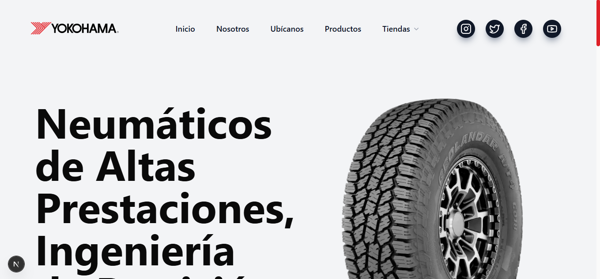
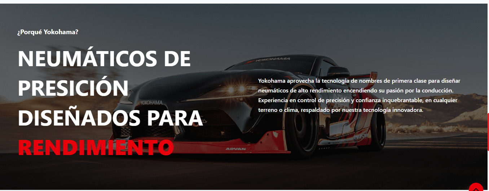
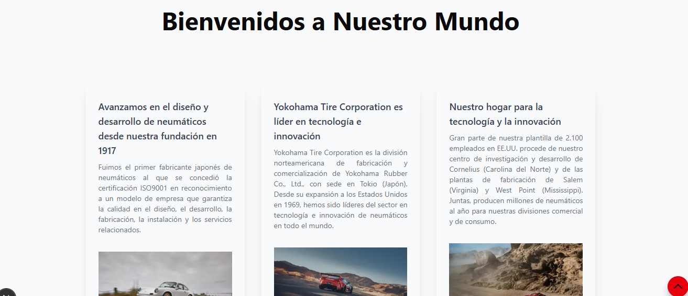
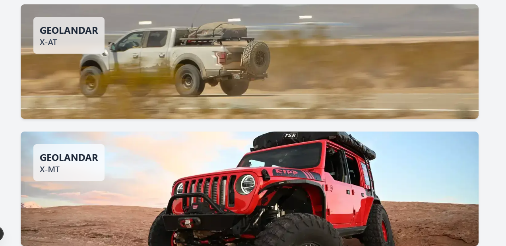
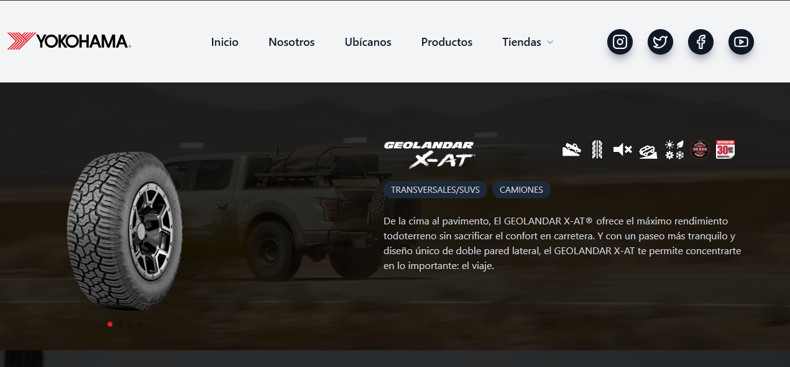

# 🏎️ Yokohama Landing Page - Next.js

<p align="center">
  
</p>

<p align="center">
  
  
  
  
</p>

<p align="center">
  <a href="URL_DE_TU_DEMO_EN_VIVO">🌐 Ver Demo en Vivo</a>
</p>

## 📝 Descripción

Este proyecto es una landing page moderna y de alto rendimiento para la marca de neumáticos Yokohama. Ha sido desarrollada utilizando Next.js para optimización de renderizado y SEO, enfocándose en la presentación de productos premium, tecnología y la herencia de la marca en el automovilismo. El diseño es _fully responsive_, adaptándose a dispositivos móviles y escritorio.

## 🚀 Problema que Resuelve

El objetivo principal de este proyecto es modernizar la presencia digital de una marca establecida. Resuelve la necesidad de:

- **Mejorar el SEO y la Velocidad de Carga:** Usando _Server-Side Rendering_ (SSR) o _Static Site Generation_ (SSG) de Next.js para un mejor posicionamiento en buscadores.
- **Presentación de Producto Impactante:** Una interfaz visualmente rica que resalta la calidad y tecnología de los neumáticos.
- **Modernización de Marca:** Una estética limpia y ágil que alinea la imagen digital con la calidad percibida de los productos Yokohama.

## 🛠️ Stack Tecnológico

- **Framework:** [Next.js](https://nextjs.org/) (React)
- **Estilos:** [Tailwind CSS](https://tailwindcss.com/)
- **Despliegue:** [Vercel](https://vercel.com/)

## 📸 Capturas de Pantalla

<p align="center">
  
  
  
  
  
  
  
  
  
</p>

## ⚙️ Instalación y Uso

Si deseas correr este proyecto localmente, sigue estos pasos:

1.  **Clonar el repositorio:**
    ```bash
    git clone [https://github.com/leoch17/yokohama-landing-nextjs.git](https://github.com/leoch17/yokohama-landing-nextjs.git)
    cd yokohama-landing-nextjs
    ```
2.  **Instalar dependencias:**
    ```bash
    npm install
    # o
    yarn install
    # o
    pnpm install
    ```
3.  **Configurar variables de entorno (si aplica):**
    Crea un archivo `.env.local` basado en `.env.example`.
4.  **Correr el servidor de desarrollo:**
    ```bash
    npm run dev
    ```
5.  Abre [http://localhost:3000](http://localhost:3000) en tu navegador.

---

Desarrollado por [Leonardo Chourio](https://github.com/leoch17)

## Implementación en Vercel

La forma más sencilla de implementar tu aplicación Next.js es utilizar la [plataforma Vercel](https://vercel.com/new?utm_medium=default-template&filter=next.js&utm_source=create-next-app&utm_campaign=create-next-app-readme), creada por los desarrolladores de Next.js.

Consulte nuestra [documentación sobre la implementación de Next.js](https://nextjs.org/docs/app/building-your-application/deploying) para obtener más detalles.
